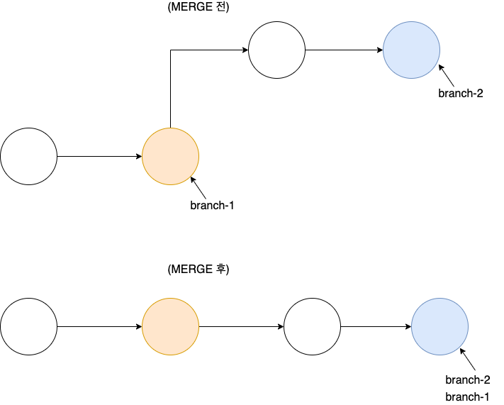
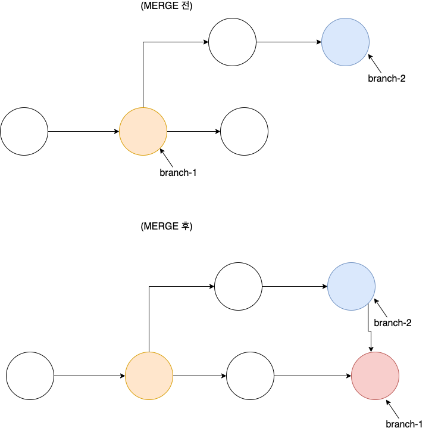
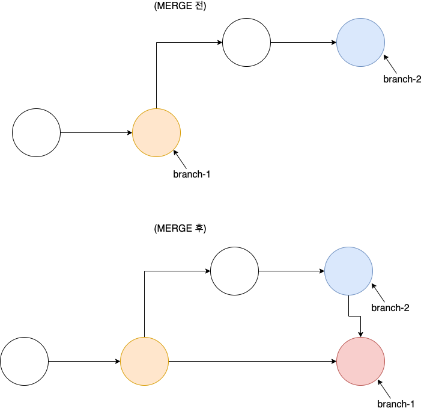

# FF(Fast Forward)

git 에서 Fast Forward 현재 브랜치와 Merge 하려는 브랜치가 선형 관계에 있어 Merge 결과 별도의 커밋 없이 커밋을 위에 쌓기만 하는 것을 말한다.

그림으로 살펴보면 아래와 같다.

branch-1 로 branch-2 를 merge 하는 상황이며, merge 커밋 없이 branch-1 의 헤더를 branch-2 로 옮겨줄 수 있다.
이런 merge 를 fast forward 라 한다.

# FF 를 할 수 없는 상황

위의 상황에서는 fast forward 가 불가능하여 merge 커밋을 생성할 수 밖에 없다.

# --no-ff 옵션

`--no-ff` 옵션을 사용하면 fast forward 가 가능한 상황에서 merge 커밋을 항상 생성하여 merge 를 진행하게 된다.
