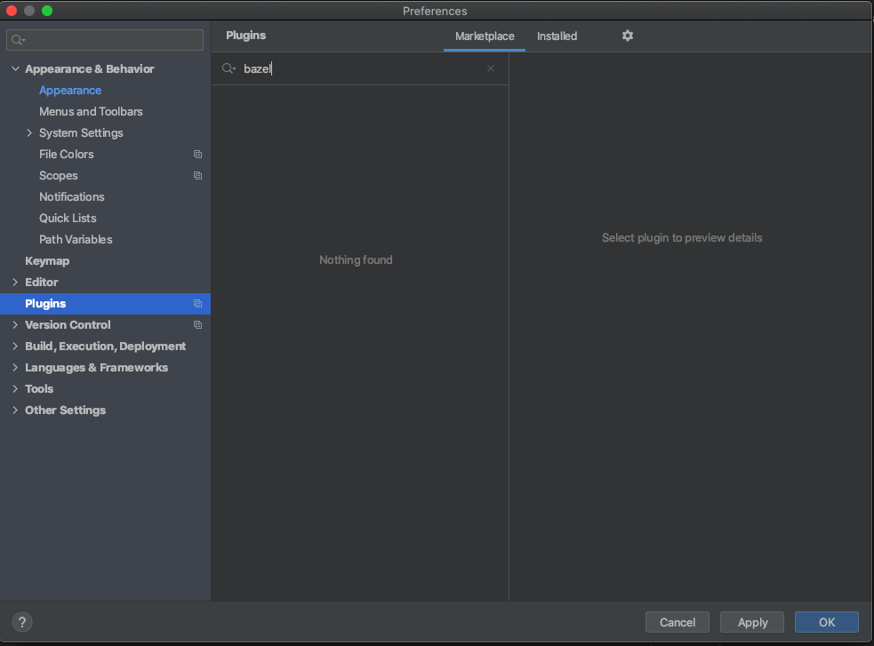
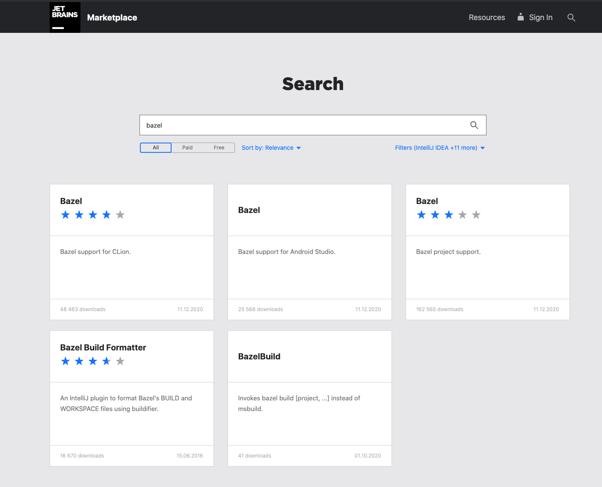
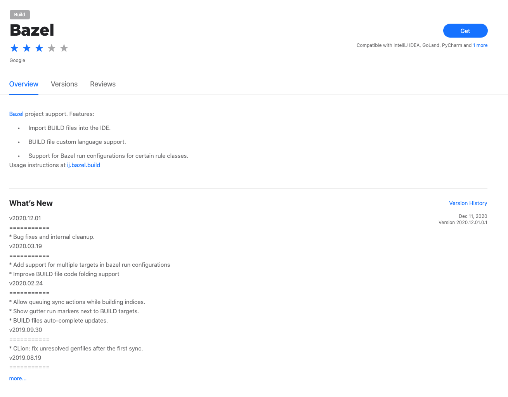
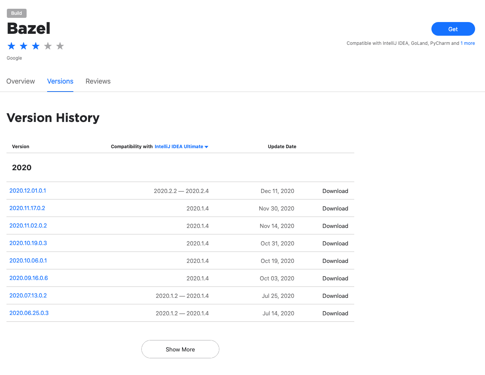
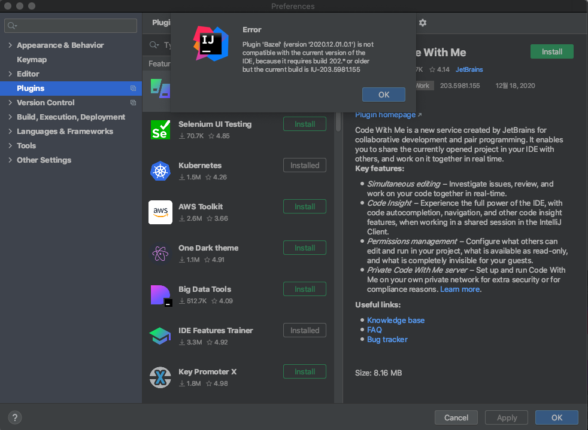
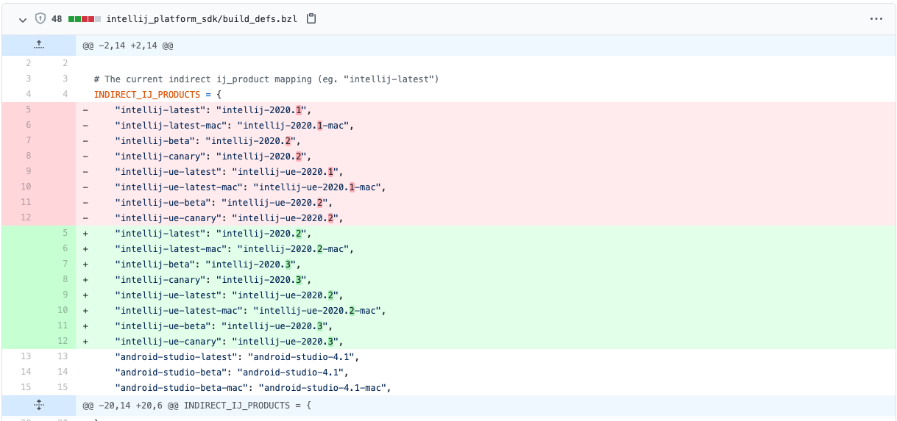
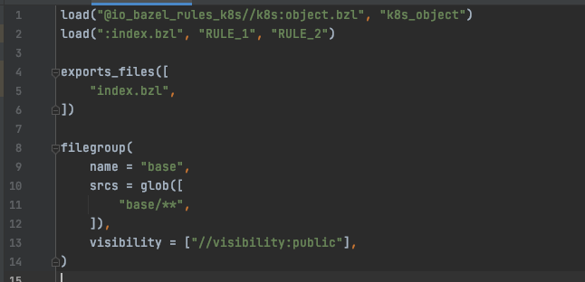

# 개요

나는 jetbrain 사의 intellij 계열의 IDE 를 주로 사용한다.
유료이긴 하지만 리팩토링 툴이나 의존성을 체크해주는 등의 기능은 그 돈 값을 충분히 한다고 생각한다.

[bazel](https://bazel.build/) 은 하나의 소스 저장소를 사용하는 모노레포 프로젝트에 적합한 빌드 도구이다.
심지어 도메인도 `.build`.

# intellij 에서도 bazel 파일들을 하이라이트를 보고 싶어!

프로젝트에 bazel 을 도입하였고, bazel 을 사용하는 일이 많다.
하지만 기본적으로 intellij 는 bazel 의 문법을 지원하지 않는다. 그렇기에 소스를 편집하거나 보는데 불편함이 있다.

누군가 플러그인을 만들어놓지 않았을까? 내가 생각한 무언가는 이미 존재하고 있을 확률이 크다.
그래서 플러그인을 검색해보았다.



!?

"없네...? 인터넷에서도 한 번 검색해보자."

[intellij marketplace 웹사이트](https://plugins.jetbrains.com/) 에서 bazel 을 검색해보았다.



"뭐야? 있는데...?"

CLion 용은 아닌거 같고 Android Studio 도 아니고, 세 번째인 것 같다.



"오 심지어 Google 에서 직접 만든거야!?"

"최근 릴리즈 일자도 2020.12.01. 나름 최신이군."



호환성을 보니 최신 버전은 intellij 2020.2.4 까지 지원한다.
현재 intellij 버전을 살펴보자.

현재 최신 버전의 intellij 는 2020.3 이다.

"오잉!?"

2020.3 은 지원이 안되네...

실제로 다운로드하여 적용해보면,



대략적으로 내부적으로 intellij 의 빌드버전은 203 인데, 내가 다운로드한 플러그인은 202 혹은 그보다 오래된 버전을 요구한다고 한다.

아니 보통 특정 버전이거나 그 보다 최신 버전이어야 한다고 하지 않나..? 얘는 왜..

그렇게 뭔가 좋은 방법이 없나 찾아보던 중, bazel 플러그인의 [github 저장소](https://github.com/bazelbuild/intellij) 를 발견하였다.

오늘자 기준으로 마지막 커밋이 이틀 전! 활발하게 업데이트되고 있는 저장소이다.
최신 소스를 받아서 빌드하면 현재 버전의 intellij 도 지원되지 않을까?
심지어 친절하게 README 에 빌드 방법 및 빌드된 파일이 나오는 장소까지 알려주고 있다.

자, 이제 다 됐다. 빌드하러 가자.

# 플러그인을 빌드하고...

우선 소스를 다운로드 받자.

```bash
$ git clone https://github.com/bazelbuild/intellij.git
```

그리고 가이드대로 빌드를 해보자. (단, 이미 bazel 은 설치되어 있어야 한다.)

```bash
$ cd intellij
$ bazel build //ijwb:ijwb_bazel_zip --define=ij_product=intellij-latest
```

순조롭게 빌드는 진행됐고, `bazel-bin/ijwb/ijwb_bazel.zip` 파일을 플러그인으로 추가해주면 된다.

intellij 설정을 열고 plugin 에서 설정을 눌러 Install Plugin from Disk 를 클릭하여 위의 zip 파일을 선택해준다.

"안되잖아!?"

아무래도 이상해서 소스에서 2020.3 을 키워드로 검색해보았지만 2020.2 는 검색이 되도 2020.3 으로는 검색이 되지 않는다.
최근까지 커밋은 올라왔지만 아직 2020.3 버전 지원은 안되고 있나보다. (이런게 제일 1순위여야 하는거 아닌가...?)

# 여기서 멈출 수 없다.

나는 밋밋한 마치 메모장과 같은 그런 환경에서 코딩을 하는 것은 정말 바보같은 짓이라고 생각한다.
왜 1960년대에나 코딩했을 법한 환경에서 2020년에 코딩해야 한단 말인가...
무엇보다 다른 파일에서 bazel rule 을 붙여넣으면 들여쓰기가 모두 사라져버린다.
생산성도 많이 떨어지게 되고, 무엇보다 __휴먼 에러__를 발생시킬 확률이 높다.

그렇기에 여기서 멈출 수 없었다. 누군가 이슈를 등록해두지 않았을까?

[github 이슈](https://github.com/bazelbuild/intellij/issues) 에서 한 페이지를 넘기기 전에 
[관련한 이슈](https://github.com/bazelbuild/intellij/issues/2102) 를 찾아볼 수 있었다.

답변을 보니 친절하게도 [PR](https://github.com/bazelbuild/intellij/pull/2246) 까지 만들어서 올려두었다.
아니! 9일 전에 올라온 PR 인데 왜 그 사이 릴리즈는 하면서 PR 은 안 받아주는것이냔 말이다.

# 그렇다면, 직접 PR 내용을 빌드하겠다.

머지않아 공식적으로 2020.3 버전을 지원하겠지만 그래도 지금 당장 불편이 크므로 위의 PR 의 내용을 빌드하여 사용해보기로 했다.

위에서 다운로드 받은 소스의 루트 디렉토리로 이동한다.
그후 해당 PR 의 소스를 브랜치로 만들어서 다운로드하자.

```bash
$ git fetch origin pull/2246/head
$ git switch -c ijwb-203 FETCH_HEAD
```

그러면 ijwb-203 브랜치에 PR 의 소스가 다운로드되었을 것이다.
이제 bazel 빌드를 똑같인 해주면 될 것 같다!

```bash
$ bazel build //ijwb:ijwb_bazel_zip --define=ij_product=intellij-latest
```

# 이제 끝...?

기쁜 마음으로 Install Plugin from Disk 를 클릭하여 zip 파일을 선택하였지만 결과는...


# 뭐가 문제지?

뭐가 문제일까? PR 올린 사람이 사기친건가? 그래서 저장소 소유자가 PR 을 안받아준건가?

그래도 안되는걸 저렇게 보란듯이 올리진 않지 않을까?

그래서...!

소스를 살펴보기로 했다.



소스코드를 보던 중 이 부분을 발견했다.

```
"intellij-latest": "intellij-2020.2",
...
"intellij-beta": "intellij-2020.3",
"intellij-canary": "intellij-2020.3",
...
```

여기다!!

빌드 시 옵션을 `--define=ij_product=intellij-latest` 로 주면, 아무래도 2020.2 버전으로 빌드가 되는 듯 하다.
따라서 `--define=ij_product=intellij-beta` 혹은 `--define=ij_product=intellij-canary` 로 시도해 볼 필요가 있을 것 같다.

나는 canary 옵션을 주기로 했다(그냥 내 맘). 그리도 ue(ultimate edition 이겠지?) 까지..

```bash
$ bazel build //ijwb:ijwb_bazel_zip --define=ij_product=intellij-ue-canary
```

# 이제 진짜로 끝!

intellij 설정을 열고 plugin 에서 설정을 눌러 Install Plugin from Disk 를 클릭하여 위의 zip 파일을 선택해준다.
(몇 번째 하는걸까..?)

감격의 순간!

더 이상 에러를 뱉지 않고 순조롭게 플러그인이 설치되었다.
이제 복붙해도 들여쓰기가 사라지지 않는다.

그리고 무엇보다...

bazel BUILD 파일에 __색깔__이 생겼다!


