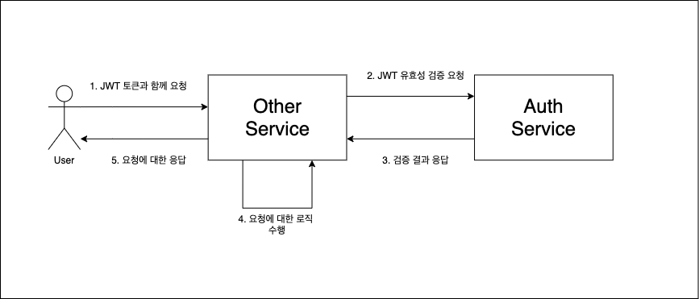
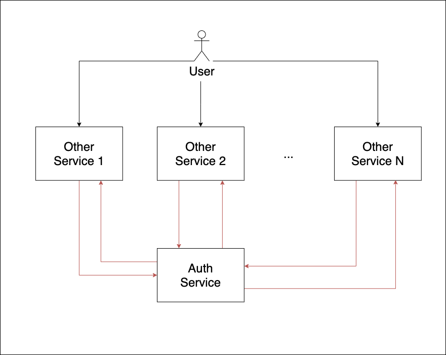
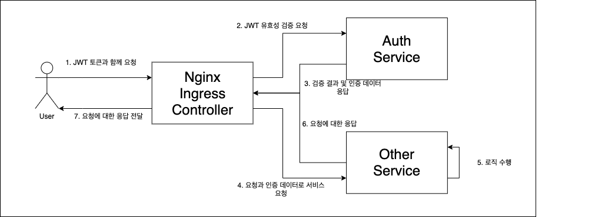

nginx ingress controller 에 대한 설명 및 설정은 [지난 포스팅](/2020-12-17-nginx-ingress-controller/index/) 을 참고하자.

# 개요

서비스를 개발하다보면 회원가입, 로그인 그리고 토큰 관리 등 인증 로직을 필요로 하게 된다.

그리고 이는 시스템 대부분에 걸쳐 활용된다.

모놀로식 서비스에서는 인증 로직을 하나의 모듈로 구현하고, 이를 다른 모듈에서 가져다 사용하는 방법으로 인증 로직을 공유할 수 있다.

마이크로서비스에서는 서브 도메인마다 서비스를 따로 배포하다보니, 모놀로식 서비스에서와는 다른 방식이 필요하다.

일반적으로 아래와 같은 2가지 방법을 생각해볼 수 있다.

1. 인증을 필요로 하는 부분은 인증 서비스에 위임하여 처리한다.
2. 인증 로직을 구현한 모듈을 라이브러리화 하여 다른 서비스 배포 시 같이 빌드하여 배포한다.

본 포스팅에서는 nginx ingress controller 를 활용하여 __1번의 방법__에 대해 알아보려고 한다.

# 간단한 구조

인증 로직을 인증 서비스로 위임했으니 다른 서비스에서 인증 로직을 필요로 하게 되는 경우, 다른 서비스는 인증 서비스를 호출해야 할 것이다.

예를 들어 User ID 와 Role 정보를 담고 있는 JWT 를 인증 토큰으로 사용하는 경우, 다른 서비스는 요청이 들어온 경우 JWT 를 인증 서비스로
전달하여 JWT 를 검증하고 User ID 와 Role 을 받아오도록 해야 할 것이다.

이를 도식화하면 아래와 같이 그려질 수 있다.



알기 쉽고 특별히 어려운 과정도 아니다.

그러나 여기서 발생하는 문제는 다른 서비스들이 늘어나게 될 때 생긴다.

아래 그림을 보자.



서비스가 많이 늘어나고 각 서비스들이 인증 로직을 필요로 한다면, 인증을 필요로 하는 모든 서비스가 각각 Auth Service 를 호출해야 할 것이다.

그 서비스를 또 각기 다른 팀에서 개발한다면, 팀마다 각기 다른 방식의 인증 호출 로직 코드가 들어갈 것이다.

이는 장기적으로 볼 때 전체 서비스에 대한 유지보수성을 떨어뜨릴 수 있다.

이를 해결하기 위해 Nginx Ingress Controller 의 auth 기능을 이용할 수 있다.

# 더 나은 구조

Kubernetes 에서 nginx ingress controller 를 이용하면 서비스로 요청을 보내기 전에 Auth Service 에서 인증을 거친 후,
인증 실패 시, 다른 서비스로 요청을 보내지 않고 바로 User 에 에러 응답을 내려주고, 인증 성공 시 인증 데이터를 주입(inject) 하여,
다른 서비스로 요청을 보낼 수 있다.

이 구조를 그림으로 나타내면 아래와 같다.



## 실제 구현

구현에 앞서 Nginx Ingress Controller 가 설정되어 있어야 한다. Minkube 에 Nginx Ingress Controller 를 설정하는 법은
[이전 포스팅](/2020-12-17-nginx-ingress-controller/index/)을 참고 바란다.

### Ingress

Ingress 에 다음과 같은 annotation 을 추가해준다.

```yaml
# ingress.yaml

apiVersion: networking.k8s.io/v1beta1
kind: Ingress
metadata:
  # Some metadata
  annotations:
    nginx.ingress.kubernetes.io/auth-url: http://auth.default.svc.cluster.local/auth/authz
    nginx.ingress.kubernetes.io/auth-method: POST
    nginx.ingress.kubernetes.io/auth-response-headers: x-auth-role,x-auth-id
spec:
  rules:
    # Define rules
```

`default` namespace 에 auth 라는 이름으로 서비스가 정의되어 있고, 해당 서비스는 `POST /authz` 경로로 요청을 받는다.
이 경로에서 JWT 를 검증하고 올바르지 않으면 에러를, 올바르면 성공을 응답할 것이다.

추가로 `x-auth-role`, `x-auth-id` 를 auth 응답 헤더르 지정하여 인증된 사용자의 역할과 ID 를 다른 서비스에서 해당 이름의
헤더로 받아볼 수 있게 하였다. 이 필드는 필요에 따라 추가, 수정하거나 삭제할 수 있다.

annotation 에 대한 자세한 설명과 추가적인 필드는 [공식 문서](https://kubernetes.github.io/ingress-nginx/user-guide/nginx-configuration/annotations/#external-authentication)를 참조한다.

### Auth Service

Auth 서비스를 전부를 이 포스팅에서 구현하긴 분량이 너무 많을 듯 하고 필요한 부분인 authz 경로의 로직을 살펴보자.

먼저 JWT 의 구조를 가정해보자. JWT 의 payload 는 다음과 같이 구성되어 있다고 가정한다.

```json
{
  "id": "string",
  "role": "string"
}
```

`id` 는 인증된 사용자의 ID 를 의미하고, `role` 은 인증된 사용자의 역할을 의미한다. 서비스에 따라 역할을 복수가 될 수도 있을 것이고,
다른 데이터가 필요하다면 추가할 수도 있을 것이다.

다음으로 authz 의 구현을 단순화하여 살펴보자.
nodejs 와 express 로 구현하였다.

```javascript
app.post('/authz', (req, res, next) => {
  const authorization = req.headers['authorization']
  // authorization = `Bearer <jwt-token>` 과 같이 전달될텐데,
  // extractJwt 함수에서는 <jwt-token> 부분을 추출한다.
  const jwt = extractJwt(authorization)
  try {
    // 일반적으로 라이브러리를 이용하여 verify 가 구현될 것이다.
    const payload = verify(jwt)
    res
      .set('x-auth-role', payload.role)
      .set('x-auth-id', payload.id)
      .statue(200)
      .send()
  } catch (error) {
    // 여기서는 토큰이 인증되지 못한 경우 401 (Unauthorized) 를 응답하도록 하였다.
    res
      .status(401)
      .send(error)
  }
})
```

### Auth Service 를 위한 ingress 정의

auth 서비스는 다른 ingress 로 정의해주어야 한다. 위의 `ingress.yaml` 에 같이 정의하게 되면, auth 도 인증 로직을 거치게 되어,
authz 를 호출할 때도 `authorization` 헤더를 요청하게 되는 문제가 발생할 것이다.

아래와 같이 새로운 ingress 를 정의하여 kubernetes cluster 에 추가해주자.

```yaml
# ingress-no-auth.yaml

apiVersion: networking.k8s.io/v1beta1
kind: Ingress
metadata:
  name: main-ingress-no-auth
  namespace: default
spec:
  rules:
    - http:
        paths:
          - path: /auth
            pathType: Prefix
            backend:
              serviceName: auth
              servicePort: 80
```

### 다른 서비스에서 인증 데이터 사용하기

`ingress.yaml` 에 다른 서비스로의 경로를 지정해주면 해당 서비스를 호출하기 전에 auth 의 `authz` 를 수행하여 인증 데이터를 주입받는다.

nodejs 와 express 로 간단히 코드를 살펴보면 아래와 같을 것이다.

```javascript
app.get('/something', (req, res, next) => {
  const role = req.headers['x-auth-role']
  const userId = req.headers['x-auth-id']
  // Do something with `role` and `userId`
})
```

# 마무리

Nginx Ingress Controller 를 이용하여 마이크로서비스 인증 로직을 하나의 서비스에서 처리하고, 다른 서비스에서는 인증 로직에 대해
신경을 쓰지 않을 수 있도록 하는 구조에 대해 알아봤다. 이를 이용하면, __서비스마다 관심사__를 분리하는데 보다 도움이 될 수 있을 것이다.

실제 프로젝트를 진행하다보면, 특정 경로로 들어오는 경우에는 인증을 거치지 않아야 하는 것이 필요할 수 있다.
이 때는 특정 경로에 대해서는 인증 로직을 수행하지 않도록 예외처리가 필요하다.

이 부분에 대해서는 다음 포스팅에서 알아보도록 하자.
