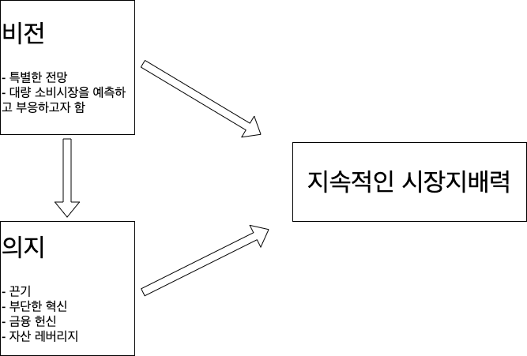

# 개요

한 달 쯤 전 지인에게 추천 받아 `마켓 리더의 조건` 이라는 책을 읽어보게 되었다.

이 책은 높은 시장 점유율을 갖는 (일반적으로 1위) 업체들은 어떤 특징을 가지고 있는지를 10년이 넘는 기간 동안 분석하여 그에 대한 결과를 서술하고 있다.

# 1장

1장을 읽으면서는 [제로투원](http://www.yes24.com/Product/Goods/15182767) 이라는 책의 내용이 떠올랐다.
제로투원을 보면, 아래와 같은 질문이 나온다.

> 정말 중요한 진실인데 남들이 당신한테 동의해주지 않는 것은 무엇입니까?

마켓 리더의 조건 1장은 시장 개척자가 정말 축복 받은 것인가? 전통적인 마케팅 법칙이라 생각했던 시장 개척 및 선점의 유리에 대한 상식에 의문을 제기한다.

## 시장 개척자이론에서 말하는 시장 개척자의 이점

일반적으로 시장 개척자들은 아래와 같은 항목에서 유리한 점을 갖는다고 한다.

- 기억의 편리함
- 브랜드 충성도
- 소비자의 타성
- 특허 장벽
- 경험의 경제
- 자원 동원

## 시장 개척자 이론의 함정

1. `시장 개척자` 라는 용어에 대한 정의가 명확하지 않다.

- 일찍 시장에 진출한 회사 중 하나인가?
- 가장 빠르게 제품을 낸 기업/사람을 의미하는 것인가?

등 명확한 정의가 내려져 있지 않다.

그리고 실제로 시장에 가장 빠르게 진출하고 제품을 낸 기업들이 후발 주자에 의해 뒤쳐지거나 사라지는 사례는 셀 수 없이 많다.

안전 면도기의 경우, 질레트가 시장 개척자로 알고 있지만 사실은 20년도 전에 안전 면도기 제품은 이미 시장에 존재했었다.
하지만 우리는 그 업체가 어떤 업체인지 어떤 브랜드인지 기억조차 못한다.

2. 시장을 리드하는 기업들은 `자기 신성화` 경향을 가지고 있다.

사실 본인 기업이 최초 제품 개발자가 아니라하더라도 그 이전의 실패한 회사들을 잘 모르고 스스로를 시장 개척자로 생각하는 경향이 있다는 것이다.
이를 self-report 편햐이라 부른다. 이 편향 때문에 진짜 성공한 이유가 시장의 선두 진출 혹은 개척이 아님에도 불구하고 그렇게 인터뷰되는 경우가 많다.

3. 실패에 대한 망각

GE 에서 진행한 과학 경영의 결과물인 PIMS (Profit Impact of Market Strategy) 의 자료가 시장 개척자 이론의 근거로 사용되고 있다.
하지만 이 PIMS 자료에서 중요한 점은 시장에서 실패한 기업에 대한 평가나 지표는 누락되어 있다는 것이다.

실패한 기업까지 모두 감안한다면 과연 시장에 가장 빠르게 진출한 기업이 여전히 유리하다고 나올까?

4. 자기본위적 시장 정의

자기본위라 함은 자신에게 이로운 방향으로 무언가를 생각하는 것을 말한다. 즉, 시장 개척자 조사를 할때 조사에 유리한 방향으로 시장을 정의하기 마련이라는 것이다.
시장이라는 것은 좁게 정의하면 어떤 기업이든 그 시장에서 개척자, 리더가 될 수 있다. 그래서 시장을 어떻게 정의하느냐에 따라 시장 개척자 혹은 리더의 기준이 달라질 수 있는 것이다.

제로투원에서는 독점 기업일수록 오히려 독점 사실을 숨기려 하고, 자신의 타겟 시장을 크게 만들어 시장 점유율을 낮추려 한다는 내용이 있었다.

그 부분과 매칭되어 인상 깊게 와닿았던 부분이다.

# 2장

이번 장에서는 필자들이 접근한 방식인 역사적 방법에 대해 설명하고, 이 방법이 왜 유용한지에 대해 설명한다.
여러가지 이유 중에서 그 시대의 시각으로 현재의 마켓 리더 기업에 대한 평가를 볼 수 있다는 점이 좋게 생각되었다.
현재의 결과로 보면, 이미 성공했고, 리더의 위치에 있는 기업이 초기에는 어떤 평가를 받았는지를 살펴보는 것은 흥미롭게 느껴졌다.

그 후에는 조사 샘플을 결정한 기준에 대해 설명하였는데, 여러 가지로 생각하면서 나름 체계적이고 객곽적이려고 노력했구나 생각이 들었다.

그래서 이 책에서는 1990년 ~ 2001년의 기간 동안 총 66개의 시장을 대상으로 역사적 방법을 통해 마켓 리더 기업의 공통점(조건)을 조사하고 그에 대한 고찰을 기록한 책이 되겠다.

2장에서 특별히 인상 깊었던 점이 있다기 보다는 빨리 다음 장으로 넘어가서 "그래서 결론이 뭐야? 마켓 리더의 조건이 뭔데?" 라는 조바심이 들었다.

# 3장

그렇다면, 현재 시장에서 지배적인 위치에 있고, 그리고 그 위치를 오랜 기간동안 존속시키는 비결은 무엇일까?

이 책에서는 시장 개척자를 다음과 같이 정의한다.
> 시장에 제품을 가장 먼저 출시한 기업

그리고 시장 지배자(리더)는 아래와 같이 정의한다.
> 시장 지배력을 획득하고 비교적 오랜 기간 지배력을 지속하고 있는 기업

여기서 시장 지배력이란 한 제품 부분에서 최고의 시장 점유율을 가지고 있는 것을 나타낸다.

시장 지배자의 정의에 대해 조금 아쉬운 점이 있다.

- 비교적 오랜 기간의 지배력이란 어느 정도 기간을 의미하는가?

-> 이 부분도 명시적으로 나와 있지는 않다. 앞 선 책의 내용을 참고삼아 추측해자면 5 ~ 10년 이상을 기준으로 삼고 있지 않을까 싶다.

이번 장의 내용에 따르면, 시장 개척자와 시장 지배자의 상관 관계는 크게 없다고 한다.

1. 시장 개척자의 실패 확률을 무려 64% 에 이른다.

2. 시장 개척자의 시장 점유율을 고작 6% 정도 밖에 안된다.

3. 시장 개척자가 시장 지배자가 되는 경우의 수는 66개 샘플 중 6개 정도였다. (10% 미만)

4. 시장 개척자가 시장 지배자가 되더라도 반 수 이상은 5년을 버티지 못했다.

더불어 현재의 시장 지배자들은 시장 개척자들에 비해 시장 진출이 평균 19년 정도 늦은 것으로 나타났다.
이 중 흥미롭게 본 시장 부분은 디지털/하이테크 부분인데 이 부문의 시장 진출 시기 차이는 평균 __7년__ 정도로 나타나 역시 꽤나 빠르게 움직이는 시장이구나를 실감할 수 있었다.

이 책에서는 지속적인 리더가 될 수 있는 조건으로 다음과 같은 5가지를 꼽았다.

- 비전 (Vision)
- 끈기 (Persistence)
- 혁신 (Innovation)
- 헌신 (Commitment)
- 자산 레버리지 (Asset Leverage)

그리고 끈기, 혁신, 헌신, 자산 레버리지 이 4가지를 묶어서 __의지(Will)__ 이라고 지칭하였다.
이 책의 표지의 서브 타이틀(Will & Vision)과 통하는 내용이었다.

## 비전 (Vision)

이 책에서 말하는 비전은 대량 시장을 목표로 하는 비전이었다. 틈새 시장 전력보다는 대량 소비 시장을 타겟으로 해야 하는 이유를 설명한다.

비전의 2 가지 중요한 구성 요소로 다음을 소개한다.

1. 비전은 역동적이고 발전적 욕구를 지닌 대량 소비시장을 집중 겨낭한다.

2. 비전은 대량 소비시장의 욕구를 파악하고 충족시킬 수 있는 특별한 전망을 가지고 있다.

마케팅 서적이나 이론에서 보면 창을 날카롭게 만들어서 시장을 뚫고 들어갈 수 있는 특별한 특장점을 만들고 이를 USP(Unique Sales Point)로 잡아서 시장에
진출하는 것을 정론으로 생각하고 있었는데, 나에게는 나름 충격적인 주장이었다. 이에 대해서는 천천히 곱씹어보면서 생각해보려한다.

## 끈기 (Persistence)

많은 매체에서 성공한 기업은 운이 좋아서, 마침 시장에 타이밍이 좋았다고 소개를 하는 경우가 많다.
하지만 시장 지배자의 실상을 들여다보면, 많은 장애물을 겪었으며 굉장히 오랜 기간 제품 개발과 연구에 매진했던 것을 확인할 수 있다.

일례로 소니(Sony)는 비디오 녹화기를 개발하는데 무려 20년이라는 시간을 쏟아부었다고 한다.

한국 스타트업 세계에는 __운칠기삼(운이 70 퍼센트이고, 실력은 30%이다.)__이라는 말이 팽배해있고, 나도 상당 부분 동의하고 있었다.
더불어 __인생은 타이밍__ 이라고 하지 않던가? 이런 말에 의미를 부여하고 자위하고 있던 내가 부끄러워지는 순간이었다.

## 혁신 (Innovation)

앞서서는 단순히 혁신이라고 소개했지만, 이 책의 소제목에는 __부단한__ 혁신이라고 쓰여있다.
한 때 성공했던 제품이라도 기술과 시장의 변화에 쓸모없는 제품이 되기도 한다.
자사의 제품을 시장에서 몰아낼지라도 부단히 혁신해야 지속적인 시장 지배력을 가질 수 있다고 말하고 있다.

## 헌신 (Commitment)

역시 단순한 헌신이 아니라 __금융__ 헌신이라는 소제목으로 쓰여있다.
종종 시장에 진출하고 제품을 개발하는 일은 막대한 금액을 필요로 하기도 한다.
이를 위해 창업자가 개인의 자금을 헌납하거나 외부에서 자금을 모은 회사만이 시장 지배력을 가진 회사가 될 수 있다고 한다.

회사를 운영하면서 자금의 중요성은 더 말로 표현할 필요는 없을 것이다. 백 번 옳은 말이다.

## 자산 레버리지 (Asset Leverage)

지속적인 시장 지배자는 새로운 부문에서 기반을 잡기 위해 현재 자산을 기꺼이 레버리지하곤 한다고 한다.
이 결정이 쉽지 않은 이유는 신제품부분이 기존 제품의 사업 부문을 와해시킬 수 있는데, 기업에서는 이런 결정을 내리기가 쉽지 않기 때문이다.

아직 이런 상황까지 마주해본 적은 없지만 향후 기회가 되어 이런 상황이 온다면, 이 챕터를 잊지 말아야겠다.

## 의지와 비전 (Will & Vision)

의지는 끈기, 혁신, 헌신, 자산 레버리지로 이루어진다. 그리고 이 의지의 출발점은 비전이다.
비전은 다른 네 가지 요소들의 원동력이자 안내자이다.

앞 서 말한 요소들을 모두 가지고 있거나 대부분 가지고 있는 회사들이 지속적인 시장 지배자로 남고, 
하나 이상 부족했던 시장 개척작들은 실패했다고 한다.

나머지 일곱 장에서는 이 요소들은 하나하나 설명한다.

# 4장

비전을 구성하는 필수요소는 __대량 소비시장__을 타겟하는 것이다.

하지만 이는 마케터가 기피하는 대상이다. 마케터는 시장을 세분화하고 그 세분화한 타겟의 욕구에 맞춰 제품의 디자인을 바꾸는 전략을 취한다.
나 역시 이를 마케팅의 정석으로 배웠었다. IR 덱을 작성할 때도 시장을 크게 잡으면 비현실적이라는 지적을 듣곤했다.

하지만, 이 책에서는 세 가지 중요한 이득을 예로 들면서 대량 소비시장에 중점을 두는 것이 중요하다고 말한다.

1. 대량 소비시장에 도달하기 위해서는 그 시장이 원하는 가격을 목표로 삼아야 하는데, 이는 경영자로 하여금 모든 연구 과정과
생산 노력을 가격에 맞게 조절할 수 있게 한다.
   
2. 일단 대량 소비시장의 문이 열리면, 원가를 낮출 수 있는 규모의 경제가 가능하다.

3. 대량 소비시장을 겨냥한 대규모 운영방식은 연구에 많은 노력을 쏟아 붓는 일을 쉽게 지원할 수 있다.

이 부분을 읽으면서도 

> 정말 중요한 진실인데 남들이 당신한테 동의해주지 않는 것은 무엇입니까?

이 구절이 떠올랐다.

대량 소비시장을 목표로 하여 성공했던 기업과 브랜드의 예시로 P&G 의 종이기저귀를 예로 들었다.

당시 종이 기저귀의 가격은 개당 8.6 센트였고, 천 기저귀의 세탁 비용은 3.5센트였다.
그래서인지 소비자들은 아기를 동반하고 여행을 갈 때에만 종이 기저귀를 사용했다.
즉, 대량 소비시장의 문을 여는데 종이 기저귀의 높은 가격이 큰 장애물이 되었다.
P&G 는 6센트의 낮은 가격으로 우수한 종이 기저귀를 생산해 대량 소비시장을 뚫기로 결심했다.
그러기 위해서 제조 단가는 3센트로 낮춰야 했다. P&G 는 그 비전을 믿고 10년을 조사했다.
그리고 결국 3센트짜리 기저귀를 생산할 수 있는 제조시스템을 마련했고, 이는 P&G 의 종이 기저귀 매출을 3억 7천만 달러로 만들어주었다.

내가 이 이야기를 읽었을 때, 상당히 감명 깊게 읽으면서 6센트면 대량 소비시장을 뚫을 수 있다고 결정할 수 있었던 논리가 궁금해지기도 했다.
정량적인 수치를 목표로 잡을 때 항상 왜 그 정도를 목표로 잡는 것이 합리적인지 결론을 짓는 것이 어려운 일인 것 같다.
관련한 부분을 좀 더 조사하고 공부해야겠다.

이 책에서는 틈새시장은 쓸모 없다고 말한다.
그 이유는 일단 대량 소비시장의 성장을 활용할 기회를 얻을 수 없으며, 대량 소비시장을 겨냥하여 개발된 새로운 기술이 기존 기술을 무용지물로 만들어버리기 때문이다.
즉, 대량 소비시장을 겨냥한 기업이 기존의 틈새시장까지도 다 집어 삼킬수 있다는 말이다.

대량 소비시장의 욕구를 충족시키기 위해서는 낮은 가격이 중요하다. 이전에 나와있던 다른 제품에 비해 파격적으로 낮은 가격에 제품을 제공해야 한다.

낮은 가격을 목표로 할 때, 경영진들은 먼저 그 가격에 맞추어 제품을 제작할 수 있는 기술을 찾아내고 개발해야 한다.
이에 따라 생산 시스템이 움직이기 때문에 대량 소비시장에 대한 비전이 생산 시스템을 움직이는 거라 할 수 있다.

또한 낮은 가격을 목표로 하는 것은 새로운 시장 진출자에게는 아주 중요한 문제이다.

`품질이 좋고 가격도 비싼 기술 vs 품질은 다소 떨어질 망정 낮은 가격을 책절할 수 있는 기술`

많은 기업들이 틈새시장을 노리면서 전자를 선택하지만, 이 책에서는 후자를 선택한 기업들이 빠른 성공을 거두었다고 이야기하고 있다.

회사가 일단 대량 소비시장을 목표로 제품을 팔고자 한다면, 운영 규모는 여러 가지 요인에 의해 상당히 커진다.
그리고 이런 막대한 운영 규모로 인해 회사는 원료 구입 및 제품 제작, 마케팅에서도 큰 경제적 이득을 누리며 큰 수익을 올리게 된다.
그리고 이렇게 증대된 이익은 신제품의 품질 향상과 가격 인하를 목표로 다시 제품 연구를 지원하게 한다.
이런 과정은 대량 소비시장의 범위를 더욱 확대하면서도 회사와 소비자에게도 모두 이로운 사이클을 형성하게 된다.

# 5장

그래서 과연 비전이란 무엇일까?

비전의 중요한 요소 중 하나는 __대량 소비시장__의 욕구에 중점을 둔다는 것이다. (앞 장에서 이야기 했다.)
여기에 더해서 비전에는 대량 소비시장을 공략할 만한 새로운 아이디어가 포함된다.

> 맥도날드는 바쁜 사람들을 위해 깨끗한 분위기와 저렴한 가격의 패스트푸드를 선보였다.
 
> 질레트는 간편하고 안전하게 면도할 수 있게 일회용 면도날을 선보였다.

> 패더럴 익스프레스는 긴급 수송을 원하는 소비자에게 빠르고 빋을 만한 배달을 제공했다.

이 아이디어들은 가끔 역설적인 특징을 갖는다.

> 지금 보기에는 너무 단순하고 분명해 보이지만 처음 제시되었을 당시에는 실현 불가능하고 급진적이며 어리석은 생각으로 보였다.

이러기 위해서는 비전가들은 동시대인들이 인정하지 않는 독특한 시각을 가지는 것이 필요하다.
(개인적으로 이 부분이 정말 어려운 부분이라고 생각한다.)

여기에 책에서는 몇 가지 의문점을 던진다.

1. 비전은 새로운 시장과 오래된 시장 모두에 똑같이 적용되는가?

시장의 나이는 비전과 관계 없다. 사실 활기 없고 겉보기에 완벽하게 갖추어진 시장이라 할지라도 소비자의 욕구를 충족시킬 새로운 방법만
있다면 언제든지 기회는 있다.

2. 비전은 개인에게 존재하는가 아니면 회사에 존재하는가?

책에서 조사한 바에 따르면 대부분의 비전은 __개인__에게 나타난다고 한다. 비전의 특성상 다수가 가질 수 있는 관점이 아니다.
한 회사의 지속적인 성공은 비전을 가진 개인이 리더십을 발휘하게 해주고 그것을 지원해주고 지켜줄만한 능력의 유무에 달려있다.

3. 비전의 발전을 방해하는 요인은 무엇인가?

비전의 발전을 가로막는 공통 요소는 아래와 같다.
- 자기 만족
- 자산 보호
- 내부 집중

이 장에서 이야기 하는 바는 비전이란 __대량 소비시장__과 그것을 겨냥하는 __아이디어__로 이루어진 것이라는 것이다.
그리고 그 아이디어는 당대에는 불가능하고 급진적으로 보이지만 실현하고나면 당연해보이는 것이다.

나머지 장에 대한 이야기는 다음 포스팅에서 다루도록 하겠다.
