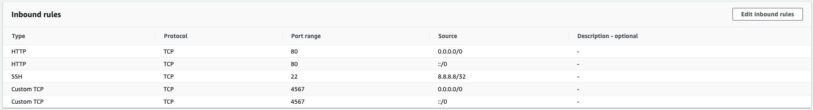
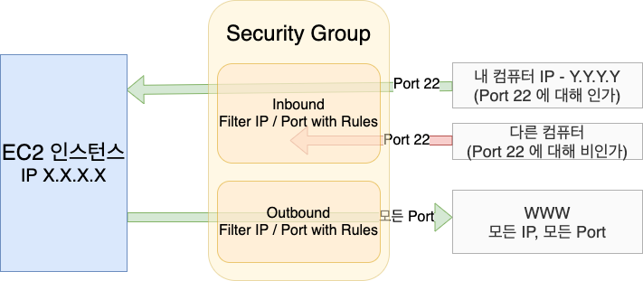
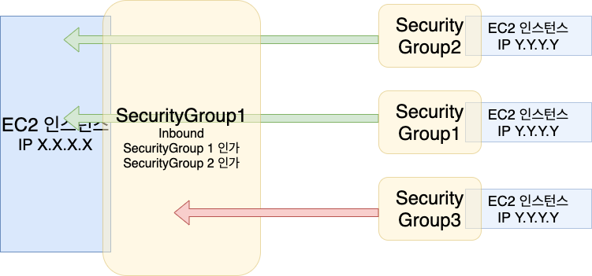

# Security Group

AWS 에서 Security Group 은 EC2 인스턴스에 대한 __방화벽__으로 동작한다.

Security Group 은 다음과 같은 것들을 제어한다.
- 포트에 대한 접근
- IP 번위에 대한 인가
- inbound(다른 컴퓨터로부터 들어오는) 네트워크에 대한 제어
- outbound(다른 컴퓨터로 나가는) 네트워크에 대한 제어

Security Group 의 예시는 아래와 같다.

Security Group 에 대한 다이어그램을 나타내면 아래와 같다.

inbound 규칙으로 22번 포트에 대해서는 내 컴퓨터 IP 로부터의 요청만 인가하고, 다른 IP 는 거부한다.
outbound 는 모든 IP 와 Port 로의 요청을 인가한다. 

## 알아두면 좋을 것들

- Security Group 은 복수의 인스턴스에 attach 될 수 있다.
- region 내 VPC 에 속해있게 된다.
- EC2 인스턴스 밖에 있어서 EC2 인스턴스에서는 Security Group 의 존재를 알지 못한다.
- SSH 접근을 위한 Security Group 을 유지하는 것이 좋다.
- 어플리케이션 접근 시 timeout 이 난다면, Security Group 이슈를 살펴보는 것이 좋다.
- 어플리케이션 접근 시 "connection refused" 가 발생한다면, 어플리케이션이나 인스턴스 자체의 이슈를 살펴보는 것이 좋다.
- 모든 기본적으로 모든 inbound 트래픽은 거부되고, 모든 outbound 트래픽은 인가된다.

## IP 대신 다른 Security Group 참조하기

inbound, outbound 규칙에 IP 대신 다른 Security Group 을 참조할 수 있다.

이렇게 다른 Security Group을 참조하면 매번 변경되는 IP 에 대응하지 않아도 된다는 장점이 있다.
