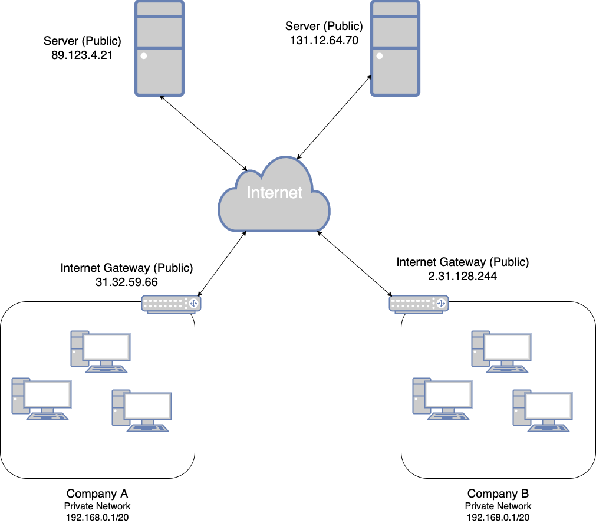

# Public IP vs Private IP

## Public IP

- 인터넷 상에서 컴퓨터를 식별할 수 있는 주소로 사용
- 전체 인터넷 상에서 유일해야 함 (두 개 이상의 컴퓨터가 같은 IP 를 사용할 수 없음)
- 지리적으로 쉽게 위치를 찾을 수 있다.

## Private IP

- Private network 상에서만 컴퓨터를 식별할 수 있는 주소
- 같은 Private network 내에서는 유일해야 함
- 그러나 서로 다른 두 개의 Private network 에서는 서로 같은 Private IP 주소를 가질 수 있음
- 컴퓨터들은 Internet Gateway 나 NAT 등을 통해 인터넷에 접근
- Private IP 를 위한 특정 IP 주소 대역이 있음

## Public IP vs Private IP 예제

상단의 Public IP 를 바로 갖는 두 대의 서버는 인터넷에 직접 연결된다.
이와 반대로 Company A, B 의 Private network 내의 컴퓨터는 각각 Private IP 를 할당 받고,
이는 각 회사의 Private netowrk 상에서만 유효하다.
그리고 Company A 의 Private IP 와 Company B 의 Private IP 는 같은 IP 가 될 수도 있다.
Company A 와 Company B 의 Private network 는 각각의 Internet gateway 를 통해
인터넷에 연결된다.
