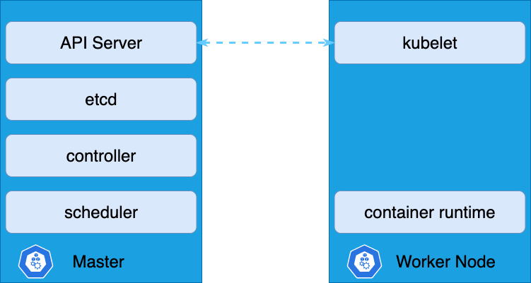

# 쿠버네티스 (Kubernetes)

이번 포스팅에서는 Node, Cluster, Master, Worker, Pod, ReplicaSet, Deployment, Namespace 와 같은 쿠버네티스의 기본 개념에 대해 다룬다.

## 노드 (Nodes)

노드는 쿠버네티스에 의해 컨테이너가 실행되는 __워커 머신__을 말한다.
노드가 실패하면 노드 상에서 돌아가는 컨테이너 역시 정상적으로 실행될 수 없다.
그렇기 때문에 하나 이상의 노드가 있어야 한다.

## 클러스터 (Cluster)

여러 개의 노드를 그룹 지은 것을 클러스터라고 한다.
하나의 노드가 실패하더라도 다른 노드를 통해 어플리케이션은 정상 접근이 가능하도록 한다.
또한 로드 밸런싱의 기능도 할 수 있다.

## 마스터 (Master)

그렇다면, __클러스터의 관리__는 누가 해야 할까?
이 책임을 맡은 것이 마스터이다.
노드를 모니터하고 노드가 실패하면, 다른 노드로 워크로드를 옮기는 역할 등 클러스터 관리의 역할을 수행한다.

마스터는 쿠버네티스에서 마스터로 설정된 또 다른 노드이다.

## 쿠버네티스 구성 요소

쿠버네티스를 설치한다는 것은 다음과 같은 요소들을 구성한다는 것과 같다.

- API Server
- etcd
- kubelet
- Container Runtime
- Controller
- Scheduler

### API Server

API 서버는 쿠버네티스에 대한 프론트엔드로 동작한다. 사용자, 관리 기기, CLI 들은 모두 API 서버를 통해 쿠버네티스 클러스터와 상호작용한다.

### etcd

key-value 쌍을 저장하는 분산된 신뢰도가 높은 저장소이다. 클러스터를 저장하기 위한 모든 데이터를 저장한다.

### kubelet

각 노드들에 실행되는 에이전트이다. 이 에이전트는 컨테이너가 노드에 기대한대로 실행되는지를 확인한다.

### Container Runtime

컨테이너를 실행하기 위한 기저에 있는 소프트웨어이다. 일반적으로 Docker 이나 다른 선택지들도 존재한다.

### Controller

노드나 컨테이너가 다운되었을 때, 알리고 반응하는 역할을 한다. 이런 경우, 새 컨테이너를 띄울지 등을 결정한다.

### Scheduler

스케줄러는 work 나 컨테이너를 여러 개의 노드들에 분배해주는 역할을 한다.


## Master vs Worker




Matser 에는 API Server, etcd, controller, scheduler 가 위치하게 되고,
Node 에는 kubelet 과 container runtime 이 위치한다.

kubelet 과 API Server 는 서로 상호작용하면서 health 체크를 하고, 마스터로부터 요청을 수행한다.

## kubectl

kubelctl 혹은 kube control 이라 부르는 커맨드라인 유틸리티이다.

kubectl 은 클러스터에 어플리케이션을 배포하거나 클러스터나 노드 정보를 가져오고 관리하는 등 클러스터 관련한 작업들을 수행하기 위해 사용한다.

### 예시

```bash
$ kubectl cluster-info
```

위의 명령어는 클러스터의 정보를 보여준다.

```bash
$ kubectl get nodes
```

위의 명령어는 클러스터의 노드를 모두 리스트업 해준다.


